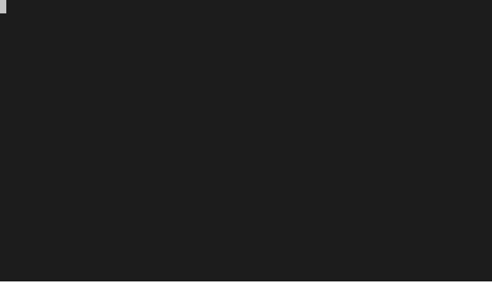

# fzf-tab-completion

Tab completion using fzf in zsh, bash, GNU readline apps (e.g. `python`, `php -a` etc.)

This is distinct from
[fzf's own implementation for completion](https://github.com/junegunn/fzf#fuzzy-completion-for-bash-and-zsh),
in that it works _with_ the existing completion mechanisms
rather than [creating a new mechanism](https://github.com/junegunn/fzf/wiki/Examples-(completion)).

## Installation

In all cases you need to [install fzf](https://github.com/junegunn/fzf#installation) first.

See the relevant READMEs for the corresponding instructions:
* [bash](./bash/README.md)
* [zsh](./zsh/README.md)
* [readline](./readline/README.md)

## Configuration

The following environment variables are supported, just as in fzf's "vanilla" completion.
* `$FZF_TMUX_HEIGHT`
* `$FZF_COMPLETION_OPTS`
* `$FZF_DEFAULT_OPTS`

See <https://github.com/junegunn/fzf#settings>

## Related projects

* <https://github.com/rockandska/fzf-obc> (fzf tab completion in bash)
* <https://github.com/Aloxaf/fzf-tab> (fzf tab completion in zsh)
